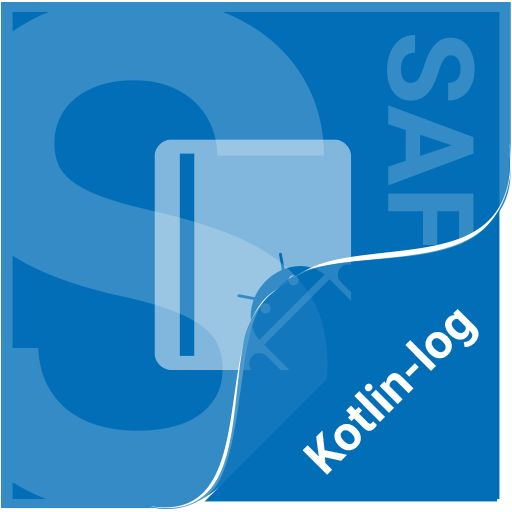

# SAF-Kotlin-log

[](http://www.weibo.com/fengzhizi715)
[](https://bintray.com/fengzhizi715/maven/saf-log/_latestVersion)
[](https://github.com/fengzhizi715/SAF-Kotlin-log/releases)
[](https://www.apache.org/licenses/LICENSE-2.0.html)




它是完全基于Kotlin开发的Android日志框架，提供极简的日志风格


# 下载安装
Gradle:

```groovy
compile 'com.safframework.log:saf-log:1.0.7'
```

Maven:

```groovy
<dependency>
  <groupId>com.safframework.log</groupId>
  <artifactId>saf-log</artifactId>
  <version>1.0.7</version>
  <type>pom</type>
</dependency>
```

# 使用方法

使用本库无需添加kotlin的配置。它可以在任何android项目中使用。

## 1.tag使用

如果不考虑显示日志的tag，可以直接使用

```java
String s = "abcd";
L.i(s);
```

如果需要使用tag，可以在Activity的onCreate()中添加如下的代码，类名则对应是tag的名称

```java
L.init(this.getClass());

```

当然，init()除了支持传递class对象，还支持传String对象。

## 2.日志级别

支持以下几种日志级别，除此之外还能将任何对象打印成json格式

| 方法名        | 作用          | 备注          |
| ------------- |:-------------:| :-------------:|
| e()       |Error级别打印日志|       |
| w()        |Warn级别打印日志|       |
| i()        |Info级别打印日志|       |
| d()        |Debug级别打印日志|       |
|json()      |将日志以json格式打印出来|       |

还可以设置全局的日志级别，最好在Application中进行全局的配置。

java中的使用方法：

```java
L.setLogLevel(L.LogLevel.INFO);
```
kotlin中的使用方法：

```kotlin
L.logLevel= L.LogLevel.INFO
```
## 3.打印日志

以e、w、i、d打印的日志风格如下：<br>
第一行显示线程名<br>
第二行显示类中打印的行数<br>
第三行显示打印的具体内容


```Java
╔════════════════════════════════════════════════════════════════════════════════════════
║ Thread: main
╟────────────────────────────────────────────────────────────────────────────────────────
║ cn.salesuite.saf.aspects.TraceAspect.traceMethod  (TraceAspect.java:35)
╟────────────────────────────────────────────────────────────────────────────────────────
║ loadUser() take [14ms]
╚════════════════════════════════════════════════════════════════════════════════════════
```

json方法的使用

```java
Object obj = ...
L.json(obj);
```

json方法可以将String、Map、对象打印成json风格，具体可以参照下图：


## 4.自定义Header

## 5.针对Kotlin项目的优化


ChangeLog
===
[版本更新记录](CHANGELOG.md)

License
-------

    Copyright (C) 2017 Tony Shen.

    Licensed under the Apache License, Version 2.0 (the "License");
    you may not use this file except in compliance with the License.
    You may obtain a copy of the License at

       http://www.apache.org/licenses/LICENSE-2.0

    Unless required by applicable law or agreed to in writing, software
    distributed under the License is distributed on an "AS IS" BASIS,
    WITHOUT WARRANTIES OR CONDITIONS OF ANY KIND, either express or implied.
    See the License for the specific language governing permissions and
    limitations under the License.
